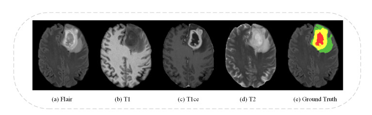

### **Milestone 1: Problem Definition & Literature Review**

Project Title: Orca \[DL ; Vision; GenAI ; NLP\]

**Problem Statement**: Accurate delineation of brain tumors is critical for diagnosis, surgical planning, and monitoring treatment response. The current clinical standard relies on manual segmentation of tumors from multi-parametric MRI (mpMRI) scans by radiologists. This process is not only extremely time-consuming and labor-intensive but also suffers from significant inter-observer variability, leading to inconsistencies in clinical assessment and treatment planning.

This project aims to develop a powerful deep learning model for the automated and precise segmentation of brain tumors from multi-modal MRI scans. The system will take MRI Scans as input and output a multi-class segmentation mask that accurately identifies different tumor sub-regions. This automated tool will provide users with a quantitative, objective, and reproducible method to assess tumor morphology, thereby improving the efficiency and reliability of treatment planning and follow-up examinations.

### **1\. Objectives of the Project**

Based on the problem statement, the primary and secondary objectives of the Orca project are defined as follows:

* Primary Objective: To design, build, and train a deep learning model that automatically and accurately segments brain tumors into their constituent sub-regions (enhancing tumor, tumor core, edema) from multi-modal MRI scans.

Source : [https://www.aimspress.com/](https://www.aimspress.com/)

* Secondary Objectives:  
  1. Achieve High Accuracy: The model's performance must be comparable to or exceed human expert accuracy. Success will be measured using standard segmentation metrics such as the Dice Similarity Coefficient (DSC) and Intersection over Union (IoU).  
  2. Develop a Multi-Modal System: The model must effectively process and fuse information from the four standard MRI modalities (T1, T1ce, T2, FLAIR) to produce a robust segmentation.  
  3. Generate Quantitative Outputs: The system will output not just a visual mask but also quantitative data, such as the volume and composition percentage of each tumor sub-region.  
  4. Create an End-to-End Solution: To extend beyond a simple segmentation mask, the project will integrate a Generative AI component to translate the quantitative data into a preliminary, human-readable report.

### **2\. Review of Existing Solutions, Baselines, and Benchmarks**

The field of automated brain tumor segmentation is well-established, with several powerful architectures and benchmarks serving as a foundation.

* Existing Solutions & Baselines (Architectures):  
  * DeepMedic is a 3D CNN architecture specifically designed for brain tumor segmentation, often using multi-scale processing.
  * U-Net: This is the de-facto standard for biomedical image segmentation. Its encoder-decoder structure with "skip connections" allows it to capture both high-level context and fine-grained spatial details, making it highly effective. Many state-of-the-art models are U-Net variants.  
  * 3D U-Net / V-Net: An evolution of the U-Net that processes the entire 3D MRI volume at once, rather than slice-by-slice. This allows the model to learn from the spatial context between slices, which can lead to more coherent and accurate segmentations.  
  * Attention U-Net: An enhancement to the U-Net that incorporates attention mechanisms. These mechanisms allow the model to learn to focus on the most relevant parts of the input image, improving its ability to distinguish tumor boundaries.  
  * Transformer-based Models (e.g., Swin-Unet): More recently, Vision Transformers (ViTs) have been adapted for segmentation. These models can capture long-range dependencies in the image more effectively than convolutional networks, offering a promising alternative to the U-Net architecture.

* Existing Commertial Solutions : 

| Company                                                | Key Differentiator & Architectural Implication                                                                                                                                                                                                                                                                                                                                                                                |                                                                                                        |
| ------------------------------------------------------ | ----------------------------------------------------------------------------------------------------------------------------------------------------------------------------------------------------------------------------------------------------------------------------------------------------------------------------------------------------------------------------------------------------------------------------- | ------------------------------------------------------------------------------------------------------ |
| **Brainlab (Elements - AI Tumor Segmentation)**        | **Surgical & SRS planning integration:** Designed to auto-segment cranial tumors fast (under a minute) and plug into planning workflows - implies heavy engineering for robust inference on contrast T1 scans, tight DICOM/registration handling, and low-latency clinical deployment. ([Brainlab](https://www.brainlab.com/surgery-products/overview-neurosurgery-products/cranial-planning/))                               |                                                                                                        |
| **Quibim (QP-Brain)**                                  | **Regulatory-cleared volumetry & longitudinal reporting:** Product intended for automatic labeling, volumetric quantification and longitudinal comparisons → implies multi-output segmentation + post-processing for biomarker extraction and normative percentile reporting. (FDA 510(k) K232231). ([Quibim Website](https://quibim.com/qp-brain/))                                                                          |                                                                                                        |
| **Brainomix (Cancer / tumor quantification)**          | **Validated biomarker extraction & clinical evidence focus:** Emphasises validated imaging biomarkers and fast cloud deployment for quantification - architecture likely prioritizes robust generalisation, explainability outputs and runtime efficiency for cloud inference. ([brainomix.com](https://www.brainomix.com/cancer/))                                                                                           |                                                                                                        |
| **icometrix (icobrain - icobrain tumor)**              | **Longitudinal monitoring / volumetry:** Provides volumetric assessments of enhancing tumor, resection cavity, edema; designed for longitudinal tracking → implies attention to registration, consistent normalization and reproducible volumetric pipelines. ([icometrix.com](https://www.icometrix.com/brain-tumors))                                                                                                       |                                                                                                        |
| **Siemens Healthineers (AI-Rad Companion - Brain MR)** | **Enterprise imaging suite integration & morphometry:** Automated brain structure segmentation + volumetry inside AI-Rad/IntelliSpace - engineered for integration with PACS/enterprise workflows and vendor MR sequences; implies robust preprocessing, harmonization and CE/FDA clearance checks per region. ([Siemens Healthineers](https://www.siemens-healthineers.com/en-us/digital-health-solutions/ai-rad-companion)) |                                                                                                        |
| **Aidoc (Neuro / Full Brain Solution)**                | **Triage & real-time alerts:** Focused on near-real-time detection and workflow orchestration rather than fine voxel-wise tumor segmentation; implies models optimized for speed, high sensitivity triage and platform integration (aiOS/CARE). ([Healthcare AI - Aidoc Always-on AI](https://www.aidoc.com/solutions/neuro/))

* Benchmarks (Datasets & Metrics):  
  * BraTS Dataset: The Brain Tumor Segmentation Challenge (BraTS) dataset is the gold standard for this task. It provides thousands of multi-modal MRI scans with manually-annotated ground truth segmentations, making it the primary resource for training and validating models.  
  * Performance Metrics: The standard metrics for evaluating segmentation quality are the Dice Similarity Coefficient (DSC) and Intersection over Union (IoU), which measure the overlap between the predicted mask and the ground truth. The Hausdorff Distance is also used to measure the distance between the boundaries of the two masks.

### **3\. Identify Gaps and Opportunities**

Despite significant progress in automated brain tumor segmentation, several limitations remain in current approaches, creating opportunities for improvement:

* **Generalization to Diverse Clinical Data**  
* Even nnU-Net, despite being highly adaptive, often shows performance drops when applied outside the benchmark BraTS dataset (e.g., to scans from different institutions or imaging protocols). 
* Opportunity: Implement robust preprocessing, normalization, and augmentation pipelines to ensure cross-dataset generalization and clinical reliability.
(https://arxiv.org/html/2510.03568v1) 
* **Multi-Modal Fusion Limitations**  
* U-Net-based models typically handle multi-modal MRI data by simple channel concatenation, which may not fully capture cross-modal dependencies.  
* Opportunity: Investigate enhanced fusion strategies within the CNN framework (e.g., modality-specific encoders, attention gates, or feature recalibration modules) to leverage complementary MRI information more effectively.
(https://www.frontiersin.org/journals/neuroscience/articles/10.3389/fnins.2022.1000587/full)
* **Sub-Region Delineation Challenges**  
* Tumor sub-regions like the enhancing core or infiltrative edema remain difficult to segment accurately, especially when their boundaries are irregular or small in size.  
* Opportunity: Introduce multi-scale feature extraction, boundary-aware loss functions, or cascaded U-Net architectures to improve fine-grained sub-region delineation.
(https://www.sciencedirect.com/science/article/pii/S2405844023064745), (https://www.frontiersin.org/journals/computational-neuroscience/articles/10.3389/fncom.2020.00003/full)

* **Lack of Explainability in CNN-Based Models**  
* While U-Net and nnU-Net achieve strong accuracy, their outputs remain black-box predictions with limited interpretability.  
* Opportunity: Incorporate explainability techniques such as class activation maps, uncertainty estimation, or attention-based modules to provide clinicians with interpretable insights into segmentation decisions.
(https://www.sciencedirect.com/science/article/pii/S1361841522001177), (https://pmc.ncbi.nlm.nih.gov/articles/PMC8321083/)
* **Clinical Integration Gap**  
* Current CNN-based models primarily output segmentation masks. Radiologists still need to manually extract quantitative data (e.g., tumor volumes).  
* Opportunity: Extend segmentation outputs with automatically computed tumor sub-region volumes, composition percentages, and integrate a Generative AI module to produce preliminary, human-readable clinical reports.
(https://pmc.ncbi.nlm.nih.gov/articles/PMC11752426/), (https://www.frontiersin.org/journals/artificial-intelligence/articles/10.3389/frai.2025.1615550/full)
* **Evaluation Beyond Dice Scores**  
* Many studies report Dice Similarity Coefficient (DSC) and IoU but overlook clinically meaningful measures like volumetric error or boundary precision.  
* Opportunity: Adopt a comprehensive evaluation strategy that incorporates both algorithmic and clinical metrics, ensuring relevance in real-world settings.(https://pubs.rsna.org/doi/full/10.1148/ryai.220231), (https://pmc.ncbi.nlm.nih.gov/articles/PMC10831514/)
