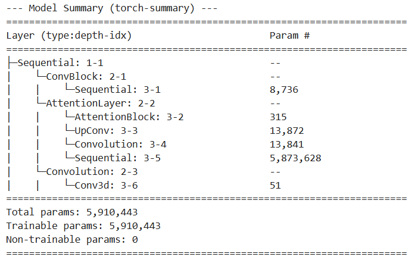

### **Model Architecture(s) for Brain Tumor Segmentation :**

This document outlines the architecture chosen for the task of 3D semantic segmentation of brain tumors from multi-modal MRI scans.


1. **3D Attention U-Net**
2. **3D Attention U-Net with K-Fold**


<br>
<br>


## 1\. 3D Attention U-Net

The Attention U-Net is an extension of the highly successful U-Net architecture. It integrates an "attention mechanism" to improve performance by focusing on the most relevant features for the segmentation task. Given the volumetric nature of MRI data, a 3D version of this network is employed.

The architecture can be broken down into three main components:

#### a) Encoder (Contracting Path)

The encoder's role is to capture the context and extract hierarchical features from the input 3D image. It consists of a series of convolutional blocks, each followed by a down-sampling operation.

* **Convolutional Blocks:** Each block typically contains multiple 3D convolutional layers, followed by a non-linear activation function (like ReLU) and batch normalization. These blocks are responsible for learning feature representations at different scales.  
* **Down-sampling:** After each block, the spatial dimensions of the feature maps are reduced (e.g., halved) while the number of feature channels is increased. This is achieved using strided convolutions or max-pooling. This process allows the network to build a rich, semantic understanding of the input image and increase its receptive field.

#### b) Decoder (Expanding Path)

The decoder's purpose is to take the compressed, high-level features from the encoder and progressively up-sample them to reconstruct a full-resolution segmentation map. Its structure mirrors the encoder.

* **Up-sampling:** The decoder uses transposed convolutions (or up-sampling followed by a convolution) to increase the spatial resolution of the feature maps at each stage.  
* **Skip Connections with Attention Gates:** This is the key feature of the Attention U-Net. Before features from the encoder path are concatenated with the corresponding decoder path features (the standard U-Net "skip connection"), they are passed through an **Attention Gate**. This gate learns to generate a weighting mask that highlights salient regions (i.e., potential tumor areas) and suppresses feature responses in irrelevant background areas. The refined, attention-weighted features are then passed to the decoder. This process forces the model to focus on the most informative features from the encoder for precise localization.

#### c) Bottleneck and Final Output

The **bottleneck** is the lowest-resolution layer that connects the encoder and decoder paths. It represents the most compressed, high-level feature representation of the input volume.

The **final layer** of the decoder is a 1x1x1 convolution that maps the feature channels from the last decoder block to the desired number of output channels. For this task, it produces 3 output channels, each corresponding to a segmentation mask for a specific tumor sub-region (e.g., Whole Tumor, Tumor Core, and Enhancing Tumor).


### Justification for Architectural Choice

The choice of a 3D Attention U-Net is well-justified for the task of brain tumor segmentation from multi-modal MRI for several reasons:

1. **Volumetric Nature of the Data:** Brain tumors are complex 3D structures. A 3D architecture can process the entire MRI volume at once, allowing it to learn and leverage inter-slice spatial context. This is a significant advantage over 2D models that process each slice independently and often struggle to produce smooth, coherent segmentations across the third dimension.  
     
2. **Superior Localization with U-Net Backbone:** The base U-Net architecture is the de-facto standard for biomedical image segmentation. Its skip connections are crucial as they allow the decoder to combine high-level semantic information (from deeper layers) with low-level, fine-grained spatial information (from earlier layers). This fusion is essential for generating segmentation masks with precise boundaries.  
     
3. **Targeted Feature Selection with Attention:** Brain tumors can be small, irregularly shaped, and vary greatly in location and appearance. Standard U-Nets can sometimes produce false positives by over-emphasizing irrelevant features in healthy tissue. The integrated Attention Gates mitigate this by forcing the model to learn to focus only on the most relevant features passed through the skip connections, leading to cleaner segmentations and better performance on small or ambiguous targets like the enhancing tumor region.


### Advantages and Disadvantages

#### Advantages:

* **Improved Accuracy and Precision:** The attention mechanism actively filters out irrelevant information, reducing false positives and leading to more accurate segmentation of target structures, especially for small and complex regions.  
* **Full Volumetric Context:** The 3D convolutional nature of the model ensures that the entire spatial context of the tumor is considered, resulting in more anatomically consistent and coherent segmentations compared to 2D approaches.  
* **Efficient Feature Fusion:** The U-Net's skip connections effectively prevent the loss of critical spatial details during the down-sampling process, which is vital for precise boundary delineation.  
* **End-to-End Learning:** The model is a single, unified network that can be trained end-to-end, simplifying the development and training pipeline.

#### Disadvantages:

* **High Computational and Memory Requirements:** 3D convolutions are computationally intensive and demand a significant amount of GPU memory. This limits the batch size that can be used during training, which can affect training stability, and substantially increases the overall training time.  
* **Increased Model Complexity:** The addition of attention gates increases the number of trainable parameters in the model, making it slightly more complex and potentially more prone to overfitting if not properly regularized or trained on a sufficiently large and diverse dataset.  
* **Data-Hungry:** While U-Nets are relatively data-efficient, 3D models in general have a large number of parameters and benefit greatly from large datasets. Performance may be suboptimal if the training data is limited or lacks sufficient variation.

### Code and Model Summery:-
```
# --- Model Definition ---
model = AttentionUnet(
    spatial_dims=3,
    in_channels=4,
    out_channels=3,
    channels=(16, 32, 64, 128, 256),
    strides=(2, 2, 2, 2),
).to(device)
```



### Current Results (For M3 and M4)

#### ... Input Data ...

#### ... Input Data to the model...


#### ... Initial Epoch ...

#### ... Epochs in between ...
#### ... Best Epoch ...


#### Example 1


#### Example 2


### **Methodology Analysis: K-Fold Cross-Validation for Model Training**


## 2\. 3D Attention U-Net with K-Fold

While the underlying model architecture, the **3D Attention U-Net**, remains the same as previously analyzed, this section details the methodology used to train and evaluate it robustly.

K-Fold Cross-Validation is a statistical method used to estimate the skill of a machine learning model on unseen data. It provides a more robust and reliable performance measure than a single train/validation split.

The process is as follows:

1. **Partitioning:** The entire dataset of patient scans is shuffled and partitioned into a set number of non-overlapping, equally-sized subsets, or "folds" (in this case, K=4 or 3 or 2).  
2. **Iterative Training:** A series of K models are trained iteratively. In each iteration:  
   * One fold is held out and used as the validation set.  
   * The remaining K-1 folds are combined and used as the training set.  
3. **Performance Aggregation:** After all K iterations are complete, the performance metrics (e.g., Dice score) from each fold's validation run are averaged. This average score serves as the overall performance estimate for the model architecture on this dataset.

The result of this process is not one single model, but K distinct models, each trained on a slightly different subset of the data.


### Justification for Using K-Fold Cross-Validation

Employing a K-Fold strategy is a standard best practice in medical imaging and is particularly well-justified for this task.

1. **Performance Estimation:** Medical imaging datasets, even large ones, can have high variability between subjects. Training on a single, fixed split of the data might lead to a model that performs exceptionally well (or poorly) simply due to a "lucky" (or "unlucky") distribution of easy or hard cases in the validation set. By training and validating across X different splits, the K-Fold approach ensures the final performance metric is a much more reliable and less biased estimate of how the model will perform on new, unseen patient data.  
     
2. **Maximizing Data Utilization:** Acquiring and annotating medical data is expensive and time-consuming, often resulting in limited dataset sizes. K-Fold Cross-Validation ensures that every single sample in the dataset is used for both training and validation exactly once across the entire procedure. This maximizes the value of the available data, as the model is tested on all parts of the dataset.  
     
3. **Foundation for Model Ensembling:** The K models generated through this process can be combined into an **ensemble** during the final prediction/inference stage. For a new, unseen patient scan, predictions can be made with all K models, and the results can be averaged or combined through a voting mechanism. This technique often leads to more robust, accurate, and reliable segmentations than any single model could produce on its own.


### Advantages and Disadvantages

#### Advantages:

* **High Confidence in Results:** The primary advantage is the generation of a statistically sound and stable performance estimate, which provides high confidence that the model's performance is repeatable and not due to chance.  
* **Effective Use of Limited Data:** It is the ideal strategy when working with small to medium-sized datasets, as it mitigates the risk of overfitting to a specific training set and ensures all data is leveraged for validation.  
* **Reduces Split-Dependency Bias:** The final evaluation is not dependent on how one particular random split was made, making the results more generalizable.  
* **Enables Model Ensembling:** Provides a natural way to create an ensemble of diverse models, which is a powerful technique for boosting performance in machine learning competitions and real-world applications.

#### Disadvantages:

* **Significantly Increased Computational Cost:** This is the most substantial drawback. The total training time and computational resource usage are multiplied by a factor of K. Training 5 separate models from scratch requires five times the GPU hours compared to training on a single split.  
* **Workflow Complexity:** The process requires managing the training, logging, and evaluation of K separate models. This adds a layer of complexity to the experiment tracking and model management pipeline.  
* **No Single Final Model:** At the end of the process, there isn't one definitive "best" model, but rather K different models. To make a final prediction system, one must either choose the best-performing model from the folds (which slightly defeats the purpose of averaging) or implement an ensembling strategy, which increases complexity and inference time.


### Current Results (For M3 and M4)

#### ... Initial Epoch ...

#### ... Epochs in between ...

#### ... Earlt Stop Epoch ...


#### Example


