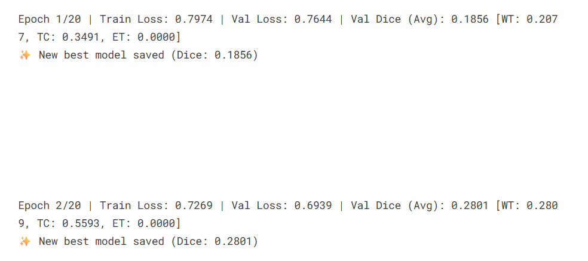

### **Model Architecture and Methodology for Brain Tumor Segmentation**

This document outlines the data pipeline, model architecture, and training methodology for the 3D semantic segmentation of brain tumors from multi-modal MRI scans.

### **1. Data Input Structure and Preprocessing**

A clear and reproducible data pipeline is critical for the model's success. The data flow begins with raw medical imaging files and transforms them into a format optimized for training.

#### **File Structure**

The dataset is organized into two main stages: raw and preprocessed. This structure ensures a clear separation between original data and model-ready inputs.

*   **Raw Data (`/kaggle/working/BRATS/train/`)**: The initial dataset consists of NIfTI files (`.nii.gz`). Each patient has a dedicated folder, which contains the different MRI modalities and the ground-truth segmentation mask.
    ```
    train/
    └── BRATS-GLI-00000-000/
        ├── BRATS-GLI-00000-000-t1c.nii.gz
        ├── BRATS-GLI-00000-000-t1n.nii.gz
        ├── BRATS-GLI-00000-000-t2f.nii.gz
        ├── BRATS-GLI-00000-000-t2w.nii.gz
        └── BRATS-GLI-00000-000-seg.nii.gz
    ```

*   **Preprocessed Data (`/kaggle/working/BRATS/processed/`)**: After preprocessing, all data for a single patient is consolidated into a single, compressed NumPy file (`.npz`). This improves I/O performance during training.
    ```
    processed/
    ├── BRATS-GLI-00000-000.npz
    ├── BRATS-GLI-00001-001.npz
    └── ...
    ```

#### **Preprocessing Pipeline**

The provided notebook (`attention-btsb.ipynb`) documents the full preprocessing pipeline using the MONAI framework. Each transformation step is crucial for standardizing the data:

1.  **`LoadImaged`**: Loads the four MRI modalities and the segmentation mask from their NIfTI files.
2.  **`ConvertToMultiChannelBasedOnBratsClassesd`**: Converts the single-channel segmentation mask (with integer labels 1, 2, 3) into a three-channel binary mask, where each channel corresponds to a specific tumor region (Whole Tumor, Tumor Core, Enhancing Tumor).
3.  **`Spacingd`**: Resamples all volumes to a uniform isotropic voxel spacing of (1.0, 1.0, 1.0) mm. This ensures that the physical size of features is consistent across all patients.
4.  **`ScaleIntensityRanged`**: Normalizes the intensity values of the MRI scans to a range of [0.0, 1.0].
5.  **`CropForegroundd`**: Removes excess background/air from the images to focus the model's attention on the relevant brain tissue.
6.  **`Resized`**: Resizes all volumes to a fixed spatial dimension of `(128, 128, 128)`. This creates uniform input tensors for the model.
7.  **`EnsureTyped`**: Casts the data to `float16` to reduce disk and memory usage.

#### **Multi-Modal Data Fusion**

The model uses an **early fusion** strategy. The four preprocessed MRI modalities (T1c, T1n, T2f, T2w) are stacked along the channel dimension. This creates a single 4-channel, 3D tensor `(4, 128, 128, 128)` for each patient, which serves as the direct input to the model's first layer.

### **2. End-to-End Architecture and Data Flow**

An architecture diagram would visually depict the entire process, from raw data to the final prediction.

1.  **Input**: The process starts with the raw `.nii.gz` files for each patient.
2.  **Preprocessing**: The MONAI pipeline transforms these files into a single `.npz` archive containing a 4-channel image tensor and a 3-channel mask tensor.
3.  **Data Loading**: The `BraTSDataset` class reads these `.npz` files, applies data augmentation (for the training set), and feeds them to the DataLoader.
4.  **Model Inference**: The 4-channel input tensor is passed through the 3D Attention U-Net.
5.  **Model Output**: The model outputs a 3-channel logit tensor of shape `(3, 128, 128, 128)`.
6.  **Post-processing**: A sigmoid activation function converts the logits into probabilities. A threshold of 0.5 is then applied to generate the final binary segmentation mask for the three tumor regions. This mask can then be overlaid on the input MRI for visualization.

### **3. Model: 3D Attention U-Net**

The Attention U-Net is an extension of the highly successful U-Net architecture. It integrates an "attention mechanism" to improve performance by focusing on the most relevant features for the segmentation task. Given the volumetric nature of MRI data, a 3D version of this network is employed.

#### a) Encoder (Contracting Path)

The encoder's role is to capture the context and extract hierarchical features from the input 3D image. It consists of a series of convolutional blocks, each followed by a down-sampling operation.

* **Convolutional Blocks:** Each block typically contains multiple 3D convolutional layers, followed by a non-linear activation function (like ReLU) and batch normalization. These blocks are responsible for learning feature representations at different scales.  
* **Down-sampling:** After each block, the spatial dimensions of the feature maps are reduced (e.g., halved) while the number of feature channels is increased. This is achieved using strided convolutions or max-pooling. This process allows the network to build a rich, semantic understanding of the input image and increase its receptive field.

#### **b) Decoder (Expanding Path)**

The decoder takes the compressed features and progressively up-samples them to reconstruct a full-resolution segmentation map.

*   **Up-sampling:** The decoder uses transposed convolutions to increase the spatial resolution.
*   **Skip Connections with Attention Gates:** This is the key feature. Before features from the encoder are concatenated with the corresponding decoder features, they pass through an **Attention Gate**. This gate learns a weighting mask that highlights salient regions (potential tumors) and suppresses irrelevant background features.

#### **c) Layer-by-Layer Architecture Details**

The specific CNN-based architecture is defined in the notebook as follows:

```python
model = AttentionUnet(
    spatial_dims=3, in_channels=4, out_channels=3,
    channels=(16, 32, 64, 128, 256), strides=(2, 2, 2, 2),
)
```

*   **Input Layer**: Accepts a multi-modal tensor of shape `(4, 128, 128, 128)`. The `in_channels=4` corresponds to the four stacked MRI modalities.
*   **Encoder Path**:
    *   **Block 1**: Convolutions transform the 4-channel input into 16 feature maps at `128x128x128`.
    *   **Block 2**: A strided convolution (`stride=2`) downsamples to `64x64x64` and increases channels to 32.
    *   **Block 3**: Downsamples to `32x32x32` with 64 channels.
    *   **Block 4**: Downsamples to `16x16x16` with 128 channels.
*   **Bottleneck**: The final encoder block produces 256 feature maps at a resolution of `8x8x8`.
*   **Decoder Path**: The decoder mirrors this process, using transposed convolutions to upsample the feature maps back to the original `128x128x128` resolution, while progressively reducing the number of channels. Attention gates refine the features from the encoder that are passed via skip connections at each level.
*   **Output Layer**: A final 1x1x1 convolution maps the features from the last decoder block to the `out_channels=3`, producing a logit score for each of the three tumor sub-regions.

### **4. Loss Function and Evaluation Metrics**

*   **Loss Function: `DiceBCELoss`**: The model is trained using a composite loss function that is a weighted average of two components:
    1.  **Dice Loss**: A region-based loss that is effective for segmentation tasks with class imbalance. It directly maximizes the overlap between the predicted mask and the ground truth.
    2.  **Binary Cross-Entropy (BCE) with Logits Loss**: A pixel-wise loss that ensures the model makes accurate predictions for each voxel independently.
    The final loss is calculated as `0.5 * DiceLoss + 0.5 * BCEWithLogitsLoss`, balancing both region-based and pixel-wise accuracy.

*   **Evaluation Metrics: Mean Dice Score**: The model's performance is assessed using the **Mean Dice Score**. During validation, the Dice score is calculated separately for each of the three tumor classes (Whole Tumor, Tumor Core, Enhancing Tumor). These three scores are then averaged. The model checkpoint with the highest validation Mean Dice Score is saved, and this metric is also used for the early stopping criterion.

### **5. Final Model Output**

The final output of the model is a 3-channel binary segmentation mask with the same spatial dimensions as the input (`3, 128, 128, 128`). Each channel corresponds to a predicted region:
*   **Channel 0**: Whole Tumor (WT)
*   **Channel 1**: Tumor Core (TC)
*   **Channel 2**: Enhancing Tumor (ET)

This output can be overlaid on the original MRI scan to provide a clear visual representation of the tumor's location, size, and substructures, as shown in the visualization examples.


### Justification for Architectural Choice

The choice of a 3D Attention U-Net is well-justified for the task of brain tumor segmentation from multi-modal MRI for several reasons:

1. **Volumetric Nature of the Data:** Brain tumors are complex 3D structures. A 3D architecture can process the entire MRI volume at once, allowing it to learn and leverage inter-slice spatial context. This is a significant advantage over 2D models that process each slice independently and often struggle to produce smooth, coherent segmentations across the third dimension.  
     
2. **Superior Localization with U-Net Backbone:** The base U-Net architecture is the de-facto standard for biomedical image segmentation. Its skip connections are crucial as they allow the decoder to combine high-level semantic information (from deeper layers) with low-level, fine-grained spatial information (from earlier layers). This fusion is essential for generating segmentation masks with precise boundaries.  
     
3. **Targeted Feature Selection with Attention:** Brain tumors can be small, irregularly shaped, and vary greatly in location and appearance. Standard U-Nets can sometimes produce false positives by over-emphasizing irrelevant features in healthy tissue. The integrated Attention Gates mitigate this by forcing the model to learn to focus only on the most relevant features passed through the skip connections, leading to cleaner segmentations and better performance on small or ambiguous targets like the enhancing tumor region.


### Advantages and Disadvantages

#### Advantages:

* **Improved Accuracy and Precision:** The attention mechanism actively filters out irrelevant information, reducing false positives and leading to more accurate segmentation of target structures, especially for small and complex regions.  
* **Full Volumetric Context:** The 3D convolutional nature of the model ensures that the entire spatial context of the tumor is considered, resulting in more anatomically consistent and coherent segmentations compared to 2D approaches.  
* **Efficient Feature Fusion:** The U-Net's skip connections effectively prevent the loss of critical spatial details during the down-sampling process, which is vital for precise boundary delineation.  
* **End-to-End Learning:** The model is a single, unified network that can be trained end-to-end, simplifying the development and training pipeline.

#### Disadvantages:

* **High Computational and Memory Requirements:** 3D convolutions are computationally intensive and demand a significant amount of GPU memory. This limits the batch size that can be used during training, which can affect training stability, and substantially increases the overall training time.  
* **Increased Model Complexity:** The addition of attention gates increases the number of trainable parameters in the model, making it slightly more complex and potentially more prone to overfitting if not properly regularized or trained on a sufficiently large and diverse dataset.  
* **Data-Hungry:** While U-Nets are relatively data-efficient, 3D models in general have a large number of parameters and benefit greatly from large datasets. Performance may be suboptimal if the training data is limited or lacks sufficient variation.


### Current Results (For M3 and M4)

#### ... Input Data ...

#### ... Input Data to the model...


#### ... Initial Epoch ...

#### ... Epochs in between ...
#### ... Best Epoch ...


#### Example 1


#### Example 2


### **Methodology Analysis: K-Fold Cross-Validation for Model Training**


## 2\. 3D Attention U-Net with K-Fold

While the underlying model architecture, the **3D Attention U-Net**, remains the same as previously analyzed, this section details the methodology used to train and evaluate it robustly.

K-Fold Cross-Validation is a statistical method used to estimate the skill of a machine learning model on unseen data. It provides a more robust and reliable performance measure than a single train/validation split.

The process is as follows:

1. **Partitioning:** The entire dataset of patient scans is shuffled and partitioned into a set number of non-overlapping, equally-sized subsets, or "folds" (eg., N_SPLITS=5).  
2. **Iterative Training:** A series of K models are trained iteratively. In each iteration:  
   * One fold is held out and used as the validation set.  
   * The remaining K-1 folds are combined and used as the training set.  
3. **Performance Aggregation:** After all K iterations are complete, the performance metrics (e.g., Dice score) from each fold's validation run are averaged. This average score serves as the overall performance estimate for the model architecture on this dataset.

The result of this process is not one single model, but K distinct models, each trained on a slightly different subset of the data.


### Justification for Using K-Fold Cross-Validation

Employing a K-Fold strategy is a standard best practice in medical imaging and is particularly well-justified for this task.

1. **Performance Estimation:** Medical imaging datasets, even large ones, can have high variability between subjects. Training on a single, fixed split of the data might lead to a model that performs exceptionally well (or poorly) simply due to a "lucky" (or "unlucky") distribution of easy or hard cases in the validation set. By training and validating across X different splits, the K-Fold approach ensures the final performance metric is a much more reliable and less biased estimate of how the model will perform on new, unseen patient data.  
     
2. **Maximizing Data Utilization:** Acquiring and annotating medical data is expensive and time-consuming, often resulting in limited dataset sizes. K-Fold Cross-Validation ensures that every single sample in the dataset is used for both training and validation exactly once across the entire procedure. This maximizes the value of the available data, as the model is tested on all parts of the dataset.  
     
3. **Foundation for Model Ensembling:** The K models generated through this process can be combined into an **ensemble** during the final prediction/inference stage. For a new, unseen patient scan, predictions can be made with all K models, and the results can be averaged or combined through a voting mechanism. This technique often leads to more robust, accurate, and reliable segmentations than any single model could produce on its own.


### Advantages and Disadvantages

#### Advantages:

* **High Confidence in Results:** The primary advantage is the generation of a statistically sound and stable performance estimate, which provides high confidence that the model's performance is repeatable and not due to chance.  
* **Effective Use of Limited Data:** It is the ideal strategy when working with small to medium-sized datasets, as it mitigates the risk of overfitting to a specific training set and ensures all data is leveraged for validation.  
* **Reduces Split-Dependency Bias:** The final evaluation is not dependent on how one particular random split was made, making the results more generalizable.  
* **Enables Model Ensembling:** Provides a natural way to create an ensemble of diverse models, which is a powerful technique for boosting performance in machine learning competitions and real-world applications.

#### Disadvantages:

* **Significantly Increased Computational Cost:** This is the most substantial drawback. The total training time and computational resource usage are multiplied by a factor of K. Training 5 separate models from scratch requires five times the GPU hours compared to training on a single split.  
* **Workflow Complexity:** The process requires managing the training, logging, and evaluation of K separate models. This adds a layer of complexity to the experiment tracking and model management pipeline.  
* **No Single Final Model:** At the end of the process, there isn't one definitive "best" model, but rather K different models. To make a final prediction system, one must either choose the best-performing model from the folds (which slightly defeats the purpose of averaging) or implement an ensembling strategy, which increases complexity and inference time.


### Current Results (For M3 and M4)

#### ... Initial Epoch ...

#### ... Epochs in between ...

#### ... Earlt Stop Epoch ...


#### Example


The whole Code : https://www.kaggle.com/code/siddhantbapna/attention-btsb